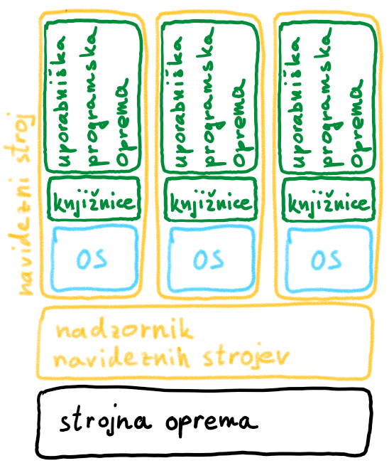
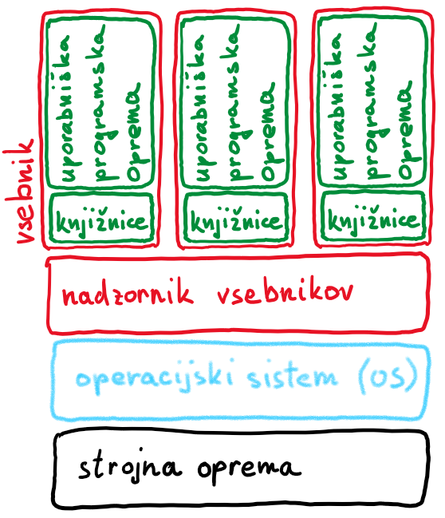
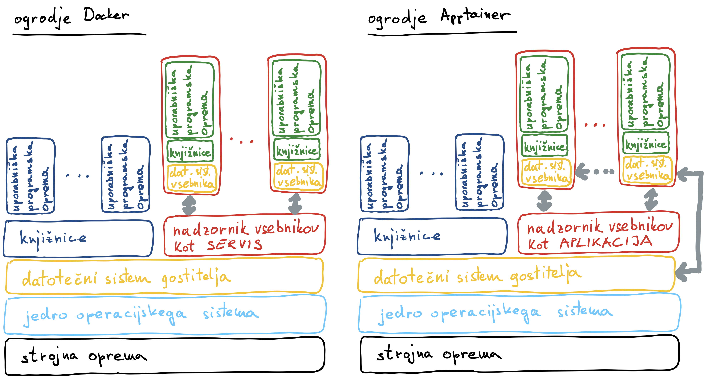

# Virtualizacija

- danes sta na voljo dve tehnologiji za virtualizacijo računalniških virov:
  - navidezni stroji (*angl.* virtual machines) za virtualizacijo strojne opreme
  - vsebniki (angl. containers) za virtualizacijo operacijskega sistema

## Navidezni stroji

- prvi poskusi abstrakcije strojne opreme pri IBM v sedemdesetih letih prejšnjega stoletja, ko so poskusili več skupinam uporabnikov omogočiti sočasno rabo računalniških virov
- sodobni računalniški strežniki ponuja toliko virov, da jih ena sama aplikacija težko učinkovito izkoristi
- za bolj učinkovito rabo in lažje vzdrževanje sistema zato na strežnike namestimo posebno programsko opremo - nadzornika navideznih strojev (*angl.* hypervisor)
- najbolj uporabljane platforme za virtualizacijo [VMware ESXi](https://www.vmware.com/products/esxi-and-esx.html), [Microsoft Hyper-V](https://docs.microsoft.com/en-us/windows-server/virtualization/hyper-v/hyper-v-technology-overview), [Proxmox](https://www.proxmox.com/en/), [KVM](https://www.linux-kvm.org/page/Main_Page)

### Shema sistema z navideznimi stroji

- shemo sistema z navideznimi stroji prikazuje spodnja slika.

  

- nadzornik navideznih strojev upravlja z navideznimi stroji, ponuja jim abstrakcijo strojne opreme fizičnega računalnika
- uporabniška programska oprema se v navideznih strojih izvaja enako, kot bi se izvajala na fizičnem računalniku
- nadzornik navideznih strojev poskrbi, da so navidezni stroji med seboj izolirani
- učinkovito upravljanjem strojne opreme (procesorjev, pomnilnika, datotečnega sistema, omrežij, ...)
- v navidezne stroje najpogosteje namestimo celoten operacijski sistem z gonilniki, potrebnimi knjižnicami in uporabniško programsko opremo

### Prednosti navideznih strojev

- navidezni stroj vključuje operacijski sistem z gonilniki, knjižnice, orodja in uporabniško programsko opremo  v popolnoma izoliranem okolju, ki lahko teče na najrazličnejših računalniških sistemih
- operacijski sistem v navideznem stroju je lahko popolnoma drugačen od gostiteljevega (Linux na Windows in obratno)
- virtualizacija strojne opreme pripomore k večji robustnosti celotnega sistema; tudi če se nek navidezni stroj zaradi napake ustavi, se bodo ostali navidezni stroji lahko nemoteno izvajali naprej
- skrbniki sistemov lahko navideznim strojem zelo natančno odmerjajo računalniške vire

### Slabosti navideznih strojev

- v vsakem navideznem stroju teče svoj operacijski sistem, kar prinese precej režije in s tem nekoliko počasnejše delovanje sistema
- čas zaganjanja in ustavljanja navideznega stroja ni zanemarljiv, saj se mora vsakič zagnati oziroma ustaviti tudi operacijski sistem
- zaradi izolacije med fizičnim računalnikom in navideznim strojem ter med navideznimi stroji kakšne posebne strojne opreme ne moremo deliti; lahko jo pripnemo k fizičnemu računalniku ali izbranemu navideznemu stroju

## Vsebniki

- za oblake in superračunalniške gruče je primernejša virtualizacija z vsebniki[^Ap25][^Ka18]
- vsebniki ne virtualizirajo strojne opreme ampak operacijski sistem
- vsebniki ne vključujejo operacijskega sistema, zato so manjši in nadzornik lažje preklaplja med njimi
- jedro operacijskega sistema Linux dovoljuje izolacijo procesov od ostalega sistema; jedro operacijskega sistema poskrbi, da so vsebniki med seboj izolirani, vsakemu vsebniku pa omogoča dostop do skupnega operacijskega sistema in osnovnih knjižnic
- v vsebniku ločeno namestimo samo potrebno uporabniško programsko opremo in dodatne knjižnice
- vsebnike upravljamo z nadzornikom vsebnikov (*angl.* container engine)
- virtualizacijo z vsebniki prikazuje spodnja slika.

  

- pomnilnik v operacijskem sistemu Linux je razdeljen na jedrni prostor (*angl.* kernel space) in uporabniški prostor (*angl.* user space)
- procesi v uporabniškem prostoru imajo omejen dostop do pomnilnika, medtem ko ima jedro dostop do celotnega pomnilnika
- jedro upravlja s strojno opremo in skrbi za osnovo delovanje sistema, med drugim tudi za upravljanje procesov v uporabniških prostorih
- v uporabniškem prostoru tečejo servisi, knjižnice in aplikacije, ki smo jih zagnali uporabniki
- programska oprema, pripravljena za eno distribucijo operacijskega sistema Linux, se velikokrat ne more izvajati na drugi distribuciji operacijskega sistemu; mnogo programov, pripravljenih za distribucijo Ubuntu, se ne more izvajati na distribuciji AlmaLinux
- kljub razlikam v distribuciji pa lahko procesi v uporabniškem prostoru dostopajo do jedra preko standardnih sistemskih klicev
- programi v uporabniškem prostoru lahko torej uporabljajo jedra iz poljubne distribucije Linux
- vsebnik lahko zgradimo na distribuciji, ki nam najbolj ustreza, ogrodje za vsebnike pa bo poskrbelo, da se bodo aplikacije v vsebniku pravilno izvajale ne glede na distribucijo, nameščeno na fizičnem stroju

### Zgodovinski razvoj vsebnikov

Operacijski sistemi so skozi čas dobivali vedno več funkcionalnosti, pomembnih za razvoj vsebnikov[^Os16]:

- 1979: v operacijski sistem Unix V7 dodajo koncept **chroot** (*angl.* change root), ki izbranim procesom navidezno spremeni osnovno mapo datotečnega sistema (*angl.* root directory)
- 2000: v operacijskem sistemu FreeBSD koncept chroot nadgradijo v ječe (*angl.* jails), ki jim dodajo lastne mrežne vmesnike z lastnimi omrežnimi naslovi
- 2002: v operacijski sistem Linux uvedejo imenske prostore (*angl.* **namespaces**), s katerimi lahko vire jedra operacijskega sistema (na primer oznake procesov, oznake uporabnikov, imena datotek, komunikacijski sklad) nadzorujemo in ustrezno izoliramo
- 2007: v jedro operacijskega sistema Linux dodajo koncept **cgroups** (*angl.* control groups), ki omogoča omejevanje, obračunavanje in izolacijo računalniških virov, na primer procesorja, pomnilnika, diska, omrežja.
- 2008: predstavijo ogrodje LXC (LinuX Container) za delo z vsebniki, zasnovano na konceptih imenskih prostorov in cgroups, ki na gostiteljskem operacijskem sistemu omogoča vzpostavitev dodatnega, navideznega (*angl. virtual*) operacijskega sistema; gre za prvo tovrstno orodje, ki dela s standardnim jedrom in je na voljo v mnogih distribucijah operacijskega sistema Linux
- 2013: podjetje DotCloud predstavi ogrodje [Docker](https://www.docker.com/), danes najpopularnejše ogrodje za delo z vsebniki; določijo format za zapis receptov za gradnjo vsebnikov in format za zapis slik vsebnikov, vzpostavijo spletni portal za objavljanje receptov
- 2014: pojavi se množica orodij, ki olajša upravljanje z vsebniki, eno najbolj znanih je [Kubernetes](https://kubernetes.io/).
- 2016: Lawrence Berkley National Laboratory začne odprtokodni projekt [Singularity](https://sylabs.io/singularity/) razvoja ogrodja za delo z vsebniki, prilagojenega za superračunalniške sisteme
- 2018: Vsebniki se vedno bolj uveljavljajo, danes predstavljajo temeljna ogrodje za izvajanje sodobne programske opreme v obliki raztegljivih oblačnih mikrostoritev na eni strani in za izvajanje računsko intenzivnih znanstvenih aplikacij na drugi strani
- 2021: Projekt Singularity se loči na dve veji: vejo, ki se razvija pod okriljem podjetja Sylabs in vejo, ki gre pod okrilje [Fundacije Linux](https://www.linuxfoundation.org/) in se preimenuje v [Apptainer](https://apptainer.org/)

### Prednosti vsebnikov

- manj režije med delovanjem, saj vsi vsebniki uporabljajo skupni operacijski sistem
- krajši časi zagona in ustavljanja vsebnika, saj ta poskrbi samo za zaganjanje in ustavljanje uporabniške programske opreme
- strojne opreme ni potrebno vnaprej razdeliti med vsebnike
- vsebniki so prenosljivi in zagotavljajo konsistentnost; prenos iz razvojnega v produkcijsko okolje običajno poteka brez kakršnihkoli stranskih učinkov
- primerni so za raztegljive (*angl.* scalable) aplikacije - raztegljivost enostavno zagotavljamo s hitrim dodajanjem novih primerkov vsebnikov
- zagotavljajo ponovljivost izvajanja poslov (enaki rezultati po nadgradnji operacijskega sistema)
- ponujajo veliko možnosti prilagajanja operacijskega sistema, orodij in uporabniške programske opreme
- pripravimo jih lahko sami (v vsebnikih imamo pravico za nameščanje programske opreme)

### Slabosti vsebnikov

- jedro operacijskega sistema si delita gostitelj in vsebnik, na gostitelju mora teči jedro, ki podpira delo z vsebniki; obstaja manjša možnost za nezdružljivost vsebnika in operacijskega sistema gostitelja
- napaka v vsebniku lahko za sabo potegne tudi nezanesljivo delovanje (zrušitev) gostitelja
- vsebnike lahko večinoma zaganjamo le na gostitelju z enakim tipom operacijskega sistema (različne distribucije Linux)
- ponujajo omejene možnosti za interaktivno delo, še posebej če uporabljamo grafični uporabniški vmesnik
- težave imamo lahko z nezdružljivostjo strojne opreme in jedra operacijskega sistema
- nezdružljivost knjižnic na operacijskem sistemu gostitelja in v vsebniku (če je potrebna komunikacije med njima)

### Vsebniki Docker

- vsebniki [Docker](https://www.docker.com/) predstavljajo industrijski standard za virtualizacijo operacijskega sistema
- na voljo je kopica orodij za orkestracijo vsebnikov Docker, mnogi upravljavci oblačnih storitev omogočajo integracijo v svoje sisteme
- primarno so namenjeni za zaganjanje storitev v oblakih, zato so zasnovani tako, da dajejo prednost izolaciji pred integracijo
- z učinkovitim upravljanjem vsebnikov strankam zagotavljajo raztegljivost programske opreme, običajno zgrajene iz množice mikrostoritev, ki se izvajajo v vsebnikih
- uporabniki lahko na spletni portal [dockerhub](https://hub.docker.com/) objavljamo recepte za gradnjo vsebnikov Docker
- vsebniki Docker imajo nekaj lastnosti, zaradi katerih niso najprimernejši za uporabo v superračunalniških okoljih
- nadzornik vsebnikov teče kot servisi z več pravicami, kot jih ima navaden uporabnik; s tem, ko imam uporabnik v vsebniku več pravi,  olajša povezovanje delovnih tokov med več vsebniki
- Vsebniki so podrejeni nadzorniku vsebnikov, ne pa uporabniški lupini

### Vsebniki Apptainer[^Ap25]

- ogrodje [Apptainer](https://apptainer.org/) je prosto dostopna različica ogrodja [Singularity](https://sylabs.io/singularity/)
- ti vsebniki so močno razširjeni na superračunalniških gručah, uporabljate pa jih lahko tudi na osebnem računalniku
- pri gradnji vsebnikov Apptainer lahko uporabljamo slike vsebnikov Docker
- vsak vsebnik je shranjen v eni sami datoteki, ki vključuje knjižnice, orodja, uporabniško programsko opremo. Zato vsebnike enostavno prenašamo med računalniškimi sistemi
- uporabnik si v vsebnike namesti poljubno programsko opremo po svojih potrebah in željah
- ogrodje uporablja enostaven varnostni model - pravice uporabnika iz gostitelja prenese v vsebnik, v vsebniku pa ne dovoli spreminjanja pravic
- ogrodje Apptainer daje prednost integraciji pred izolacijo, s čimer olajša uporabo posebne strojne opreme: grafičnih procesnih enot, nizkolatenčnih širokopasovnih omrežij in dostop do datotečnega sistema gostitelja
- vsebnike lahko opremimo s kriptografskimi mehanizmi, preko katerih uporabnik lahko preveri izvor vsebnika in se prepriča, da ni bil spremenjen
- nadzornik vsebnikov Apptainer Launcher je navadna aplikacija, ki jo zaženemo iz uporabniške vrstice in se samodejno zaustavi, ko vsebnik zaključi z izvajanjem

## Primerjava ogrodij Docker in Apptainer

  

[^Ap25]: Sylabs, [Apptainer User Guide](https://apptainer.org/docs/user/latest/introduction.html#why-use-apptainer), 2025

[^Ka18]:  A. Kashev, [Working with Containers](https://goo.gl/YMcNLM), ISPDC 2018 Tutorial, University of Bern 2018

[^Os16]: R. Osnat, [A Brief History of Containers: From the 1970s Till Now](
https://blog.aquasec.com/a-brief-history-of-containers-from-1970s-chroot-to-docker-2016), Blog, 2020
