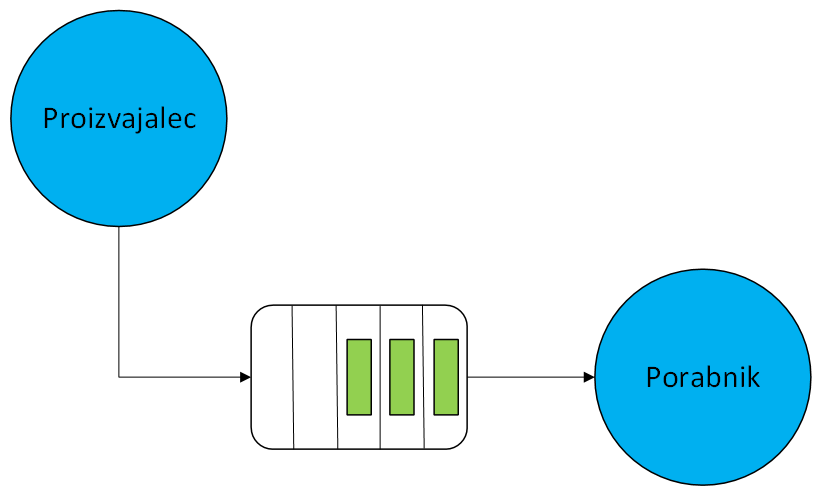

# Proizvajalci-porabniki

V porazdeljenih sistemih se pogosto pojavlja vzorec proizvajalec-porabnik, kjer sodelujeta dva tipa procesov:
    - proizvajalci, ki generirajo zahteve, dogodke ali podatke;
    - porabniki, ki te zahteve, dogodke ali podatke obdelujejo.

Ključno je, da komunikacija poteka preko skupnega medpomnilnika.
Ta pristop omogoča usklajevanja hitrosti med proizvajalci in porabniki: proizvajalec lahko dela hitreje ali počasneje kot porabnik, medpomnilnik pa služi kot vmesni prostor, ki zagotavlja, da podatki ne izginejo.

V programskem jeziku Go, lahko ta koncept realiziramo s pomočjo gorutin (proizvajalci in porabniki) in kanalov (skupni medpomnilnik).



Primeri implementacij proizvajalcev in porabnikov:
 - Ustvarjanje proizvajalcev in porabnikov, v glavni niti ne počakamo, da se zaključijo.
[Primer 1](koda/proizvajalec-porabnik-1.go)
 - Ustvarjanje proizvajalcev in porabnikov, v glavni niti ustavi proizvajalce in porabnike, vendar ne počaka.
[Primer 2](koda/proizvajalec-porabnik-2.go)
 - Ustvarjanje proizvajalcev in porabnikov, v glavni niti ustavi proizvajalce in porabnike ter počaka.
[Primer 3](koda/proizvajalec-porabnik-3.go)


# Domača naloga 4

Napišite program v jeziku Go, ki bo omogočal procesiranje naročil ki jih kupci oddajo preko spletne trgovine. Rešitev oddajte preko [spletne učilnice](https://ucilnica.fri.uni-lj.si/mod/assign/view.php?id=60402).

**Navodila:**
Uporabimo strkture, ki smo jih imeli že pri prejšnji domači nalogi.
Definirajte vmesnik `narocilo`:
```Go
type narocilo interface {
	obdelaj() float64
}
```

in tri strukture za različne vrste naročil, ki jih obiskovalci spletne trgovine lahko izvedejo:

```Go
	type izdelek struct {
		imeIzdelka string
		cena float64
		teza float64
	}

	type eknjiga struct {
		naslovKnjige string
		cena float64
	}

	type spletniTecaj struct {
		imeTecaja string
		trajanjeUre int
		cenaUre float64
	}

```

Za vsak tip naročila implementirajte vmesnik `narocilo`. Metoda `obdelaj` naj izpiše postavke naročila na zaslon in ceno izdelka prišteje globalni spremenljivki `promet` v kateri beležimo skupno vrednost vseh obdelanih naročil. Prav tako naj se v globalni spremenljivki `stNarocil` beleži skupno število izvedenih naročil.

Primer izpisa metode `obdelaj()`:
```
Številka naročila: 1
Ime izdelka: Prenosni računalnik
Cena: 2000 €
Teža: 2.5 kg
```

Ustvarite **pet** gorutin (proizvajalce), ki naključno generirajo naročila različnih tipov. Vsaka gorutina naj generira po dve naročili na sekundo.
Ustvarite **dve** gorutini, ki naročila obdelujejo (porabniki) s pomočjo metode `obdelaj`. Obdelava naročila naj traja 0,5 sekunde. 
V programu omogočite varno zaustavitev spletne trgovine. Ob pritisku na **tipko**, naj se spletna trgovina zaustavi: ne sprejema več novih naročil. Vsa naročila, ki so bila že oddana naj se obdelajo, nato naj se izpiše skupen promet in število naročil.

Pri posodabljanju spremenljivk `promet` in `stNarocil` s ključavnicami poskrbite, da ne pride do hkratnega spreminjanja vrednosti iz strani več gorutin. Prav tako poskrbite, da se izpisi različnih naročil med sabo ne premešajo.

**Rok za oddajo: 16. 11. 2025**